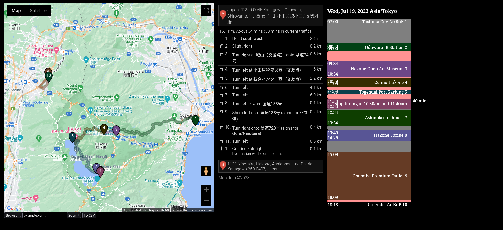

# IT-nerary

## Setup

1. Obtain a Google maps API key
2. Replace `API_KEY` in `index.html` with your api key
3. Start a local server to host the files
    - a simply way is to simply use `python -m http.server`

No JS dependencies needed!

## Generated itinerary




The generated UI have the following features:

### Map

The map displays all the location and routes in the itinerary.
Each location is marked with a coloured pin and driving routes between the pins is also shown.

Clicking on the routes displays the driving direction between pins.

(Transit directions are not possible due to current limitations on Google's API)


### Time table

The time table shows the events of the whole trip, where each coloured block corresponds to the location pin.

The starting time of each location is computed base on the starting time and the total time spent on travelling and at locations.

If no `travel` is specified between two `places`, then the program will estimate the travel time using the **driving time**.
These are indicated by **red blocks**.

For a more accurate time table, it is advised to manually fill in the travel times to account for different modes of travel.
These are indicated by **grey blocks**.

Hovering over the place blocks in the time table will reveal the notes (`events`) that will occur at the location and its duration.

Hovering over the travel blocks will reveal the duration, and clicking on them will show the corresponding travel directions on Google Maps.

### Export CSV

You can also export the itinerary as a CSV file, which you can then import into Google Calendar to keep track during your trip.

Do be careful of the time zone settings on Google.

## Data format

The itinerary is stored as a YAML file in the following format:
- headers
- itinerary, which consists of:
    - starting location
    - list of places or travel events

There is no UI programmed for keying of data, so use any text editors you are comfortable with to do this.

### Headers
```
ianaTimeZone: Asia/Tokyo
```

This tells tells our program that our times are using the above time zone as reference.

---

The itinerary has the following format:
```
starting location -> [travel] -> place -> [travel] -> place -> ... -> place
```

where each `travel` is optional.

### Starting location

```
start: 
  # DD/MM/YYYY format
  date: 20/07/2023
  # HH:mm in 24 hours format
  time: 07:00

  # also need this because JS somehow doesn't know the GMT difference of the time zone in the headers
  # and I'm too lazy to figure it out
  timeZone: +09:00
  name: Toshima City AirBnB

  # To get the latitude and longitude of a place, consult Google
  loc:
    lat: 35.7263
    lng: 139.7154
```

### Travel

```
- travel:
  # in mins
  duration: 90
```

A travel event is simply a duration in minutes.

If omitted, the program will use the driving time base on Google Maps for computing the timeline of future events.

If you wish to connect two places with no travel time, you can simply create a travel event with `duration=1`.

### Place

```
- place:
    # for display purposes only
    name: Odawara JR Station
    loc:
      lat: 35.256611337447495
      lng: 139.1553502826661

    # time spent at the location
    duration: 30

    # events for notes
    events:
      - rent car
```

### Overall file

`example.yaml`: 

```
ianaTimeZone: Asia/Tokyo

start: 
  date: 20/07/2023
  time: 07:00
  timeZone: +09:00
  name: Toshima City AirBnB
  loc:
    lat: 35.7263
    lng: 139.7154

itinerary:
- travel:
    duration: 90

- place:
    name: Odawara JR Station
    loc:
      lat: 35.256611337447495
      lng: 139.1553502826661
    duration: 30
    events:
      - rent car

- place:
    name: Hakone Open Air Museum
    loc:
      lat: 35.24525075768015 
      lng: 139.05144743310004
    duration: 60

- place:
    name: Cu-mo Hakone
    loc:
      lat: 35.247091676866305
      lng: 139.03545683912762
    duration: 30
    events:
      - soak free footpath with views

- place:
    name: Togendai Port Parking
    loc:
      lat: 35.23837784647523
      lng: 138.99435549944045
    duration: 15
    events:
      - park car here

- place:
    name: Hakone Pirate Ship to Motohakone Port
    loc:
      lat: 35.20096568250599
      lng: 139.03055605859396
    duration: 40
    events:
      - ship timing at 10.30am and 11.40am

- travel:
    # No travel needed as the ship has transported us there
    duration: 1

- place:
    name: Ashinoko Teahouse
    loc:
      lat: 35.20166980987378
      lng: 139.03110987113547
    duration: 60
    events:
      - lunch

- travel:
    duration: 15

- place:
    name: Hakone Shrine
    loc:
      lat: 35.20504302384117
      lng: 139.02538561105797
    duration: 40

- travel:
    duration: 40

- place:
    name: Gotemba Premium Outlet
    loc:
      lat: 35.30696891141022
      lng: 138.96213297101974
    duration: 180
    events:
      - shopping
      - dinner
- place:
    name: Gotemba AirBnB
    loc:
      lat: 35.3030512088
      lng: 138.963026599
```
